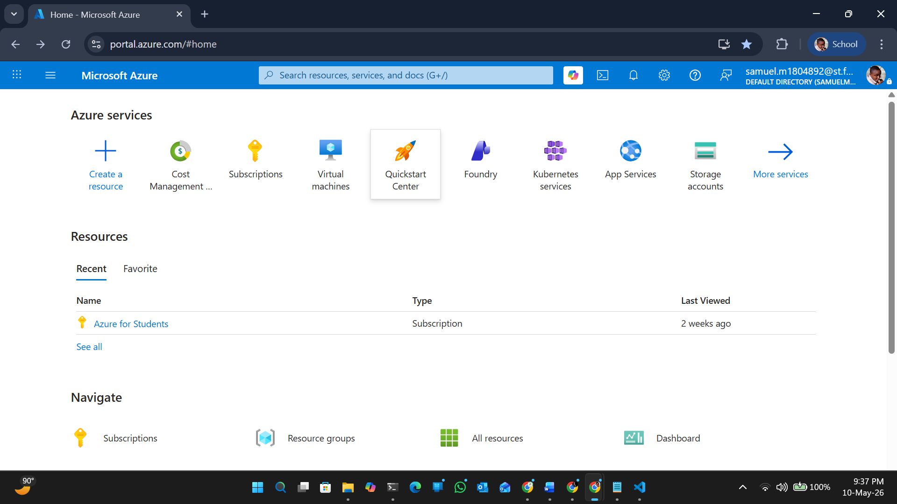
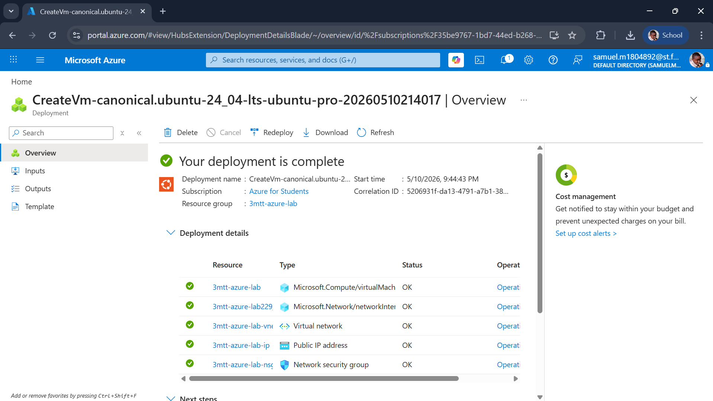
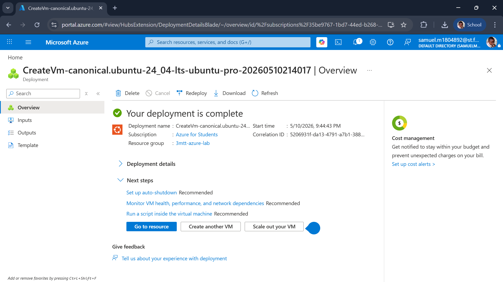
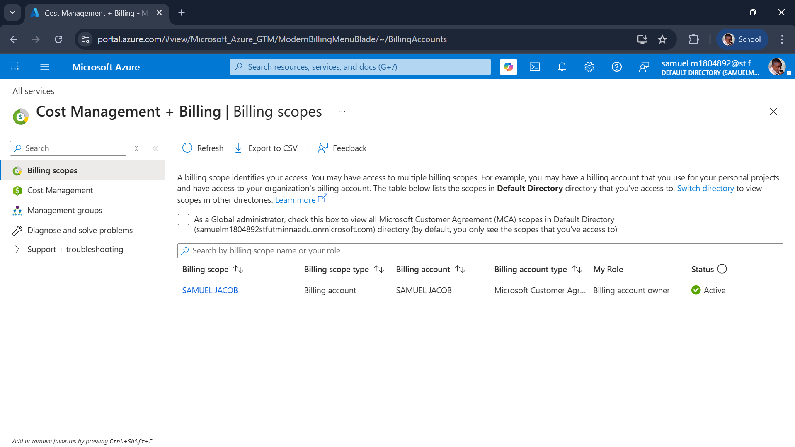

# Azure Fundamentals Lab Report

## 1. Subscription Overview

I successfully created an Azure account and accessed my active subscription via the Azure Portal.

## 2. Resource Group

A resource group named `3mtt-azure-lab` was created in the South Africa North region. This acts as a logical container for all deployed resources.

## 3. Selected Region

The chosen region for deployment is South Africa North due to its proximity to Nigeria, ensuring reduced latency and better performance.

## 4. Resource Deployed

A test resource ( Virtual Machine ubuntu 24.04) was deployed to understand Azure provisioning and configuration workflow.

## 5. Shared Responsibility Model

In the Shared Responsibility Model:

- Microsoft Azure is responsible for the physical infrastructure, networking, and host security.
- I am responsible for:
  - Configuring the virtual machine/storage securely
  - Managing access control (RBAC)
  - Securing data and applications deployed on the resource

## 6. Cost Management

I accessed Azure Cost Management + Billing and reviewed budget tools to monitor usage and ensure I remain within the free tier limits.

