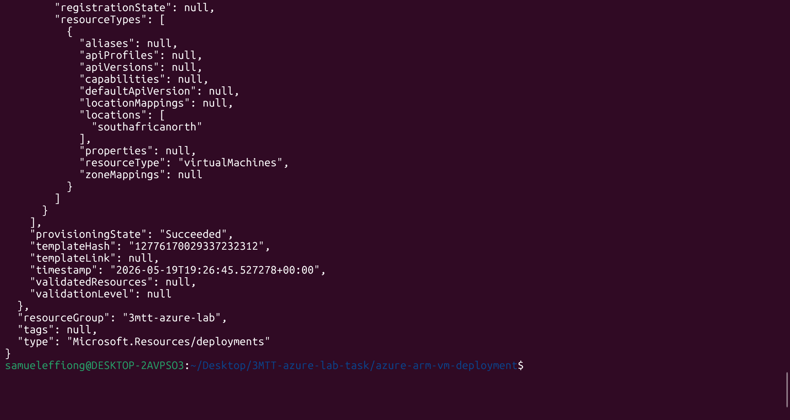
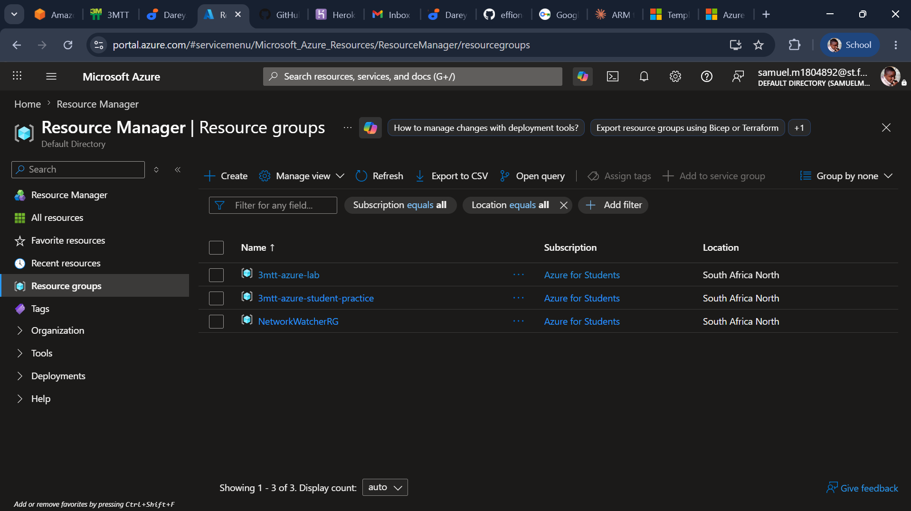
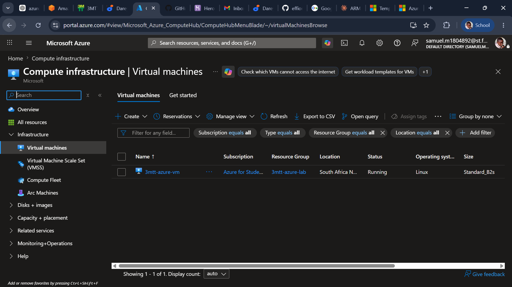
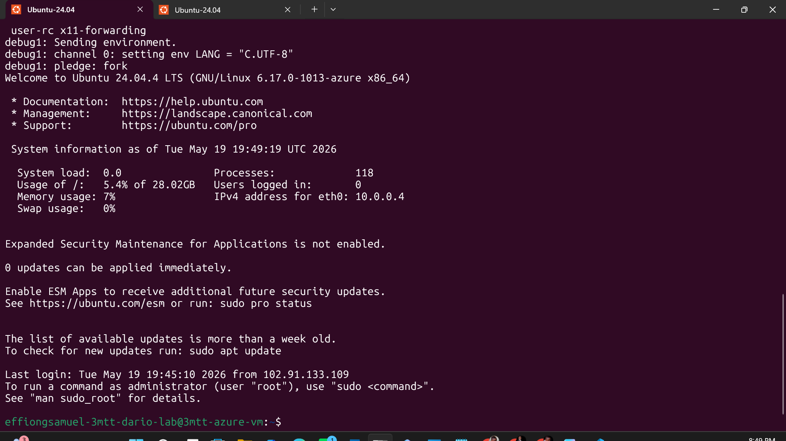

**Project Overview**

This folder contains an Azure Resource Manager (ARM) template and supporting artifacts to deploy a single Virtual Machine (VM) with networking resources.

**Objectives**

- **Deploy** a VM with networking using an ARM template.
- **Provide** a repeatable set of Azure CLI commands for validate/deploy/verify.
- **Include** screenshots and logs for verification and troubleshooting.

**Folder Structure**

azure-arm-vm-deployment/

- templates/
  - [templates/azuredeploy.json](templates/azuredeploy.json)
  - [templates/azuredeploy.parameters.json](templates/azuredeploy.parameters.json)
- screenshots/
  - [screenshots/deployment-success.png](screenshots/deployment-success.png)
  - [screenshots/resource-group.png](screenshots/resource-group.png)
  - [screenshots/vm-running.png](screenshots/vm-running.png)
  - [screenshots/ssh-connection.png](screenshots/ssh-connection.png)
- logs/
  - [logs/deployment-output.txt](logs/deployment-output.txt)
- README.md
- .gitignore

**ARM Template (templates/azuredeploy.json)**

The ARM template provided under `templates/azuredeploy.json` contains the following sections:

- `parameters`  user-configurable values (VM size, admin username, SSH key, etc.)
- `variables`  computed values used by resources
- `resources`  definitions for Virtual Network, Subnet, Public IP, Network Security Group (NSG), Network Interface (NIC), and Virtual Machine
- `outputs`  important values to be returned after deployment (public IP, VM id, etc.)

Ensure the template includes the following resources:

- Virtual Network
- Subnet
- Public IP
- Network Security Group (with SSH inbound rule)
- Network Interface
- Virtual Machine

**Prerequisites**

- Azure account with permission to create resources
- Azure CLI installed and logged in (`az login`)
- A target subscription and region (example below uses `southafricanorth`)

**Deployment Steps (Azure CLI)**

1. Login to Azure

```bash
az login
```

1. Create a Resource Group

```bash
az group create \
  --name 3mtt-azure-lab \
  --location southafricanorth
```

1. Validate the ARM template

```bash
az deployment group validate \
  --resource-group 3mtt-azure-lab \
  --template-file templates/azuredeploy.json \
  --parameters @templates/azuredeploy.parameters.json
```

1. Deploy the ARM template

```bash
az deployment group create \
  --resource-group 3mtt-azure-lab \
  --template-file templates/azuredeploy.json \
  --parameters @templates/azuredeploy.parameters.json
```

**Save Deployment Output**

To save the JSON output of the deployment to the logs folder:

```bash
az deployment group create \
  --resource-group 3mtt-azure-lab \
  --template-file templates/azuredeploy.json \
  --parameters @templates/azuredeploy.parameters.json \
  --output json > logs/deployment-output.txt
```

**Validation / Verify Deployment**

1. Get the public IP address of the VM

```bash
az vm list-ip-addresses \
  --resource-group 3mtt-azure-lab \
  --output table
```

1. SSH into the VM (replace `PUBLIC_IP` with the address returned above)

```bash
ssh effiongsamuel-3mtt-dario-lab@PUBLIC_IP
```

**SSH Access Instructions**

- By default the template should create and allow SSH (port 22) via NSG rule. Use the `effiongsamuel-3mtt-dario-lab` account (admin username set in `azuredeploy.parameters.json`).
- If using SSH key authentication ensure your public key is set in the parameters file.

**Troubleshooting**

- Deployment validation fails: check `az deployment group validate` output and ensure parameter values are correct.
- NSG blocks SSH: verify NSG rules and ensure port 22 is allowed from your IP.
- VM provisioning failed: review the deployment operation details in the Azure Portal or inspect `logs/deployment-output.txt`.
- Permission errors: ensure your account/subscription has sufficient rights to create resources.

**Screenshots**

- Successful deployment: 
- Resource Group view: 
- VM running state: 
- SSH connection success: 

**Output Logs**

Deployment outputs are saved to: [logs/deployment-output.txt](logs/deployment-output.txt)

**Next Steps / Notes**

- Review and customize `templates/azuredeploy.parameters.json` before deployment.
- Consider adding a Managed Identity or KeyVault for production secrets.
